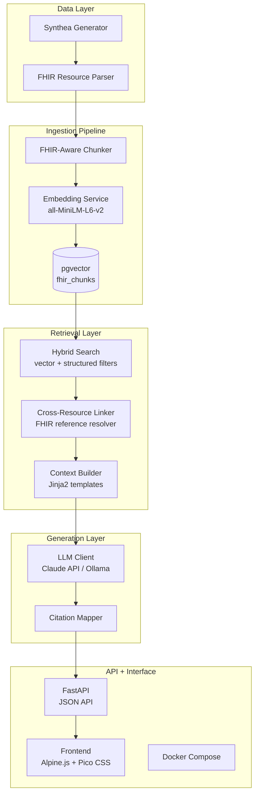
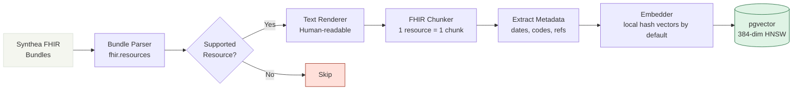
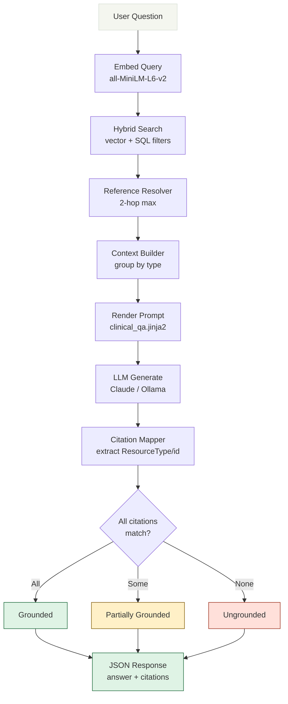
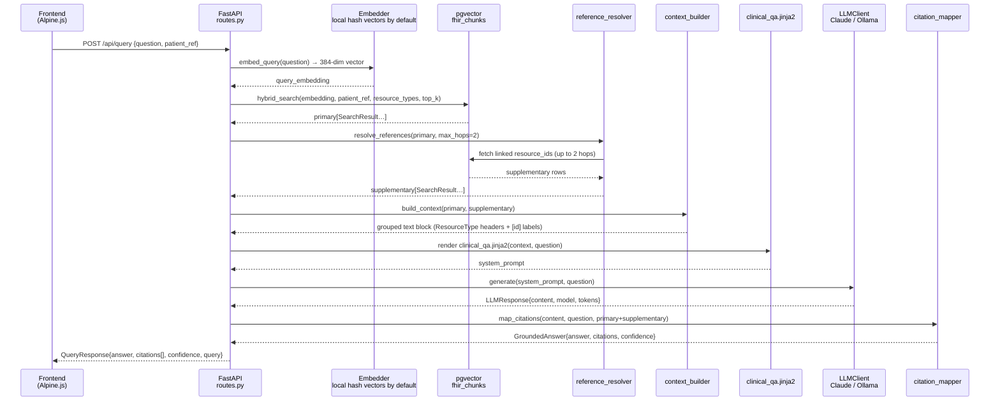
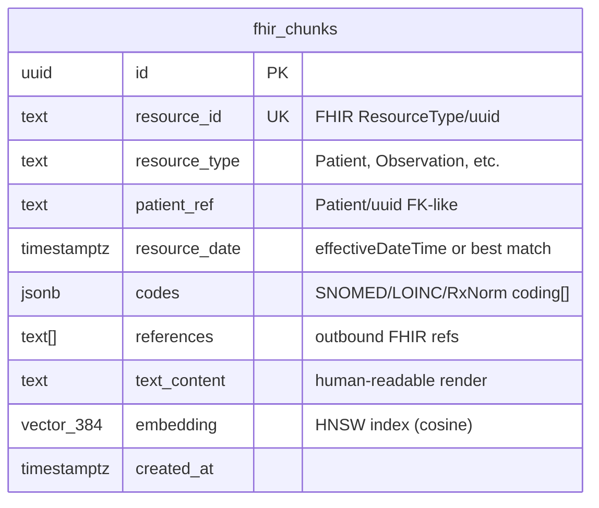
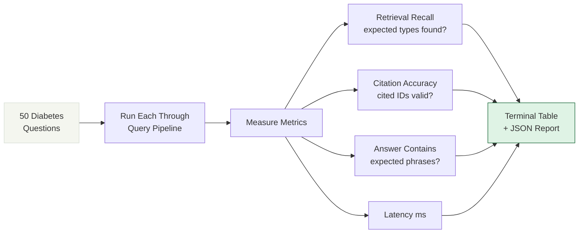

# Diabetes FHIR RAG

Diabetes FHIR RAG is a clinical data assistant for grounded question answering over Type 1 and Type 2 diabetes records. It ingests Synthea FHIR R4 Bundles, preserves resource boundaries and references, retrieves relevant resources with pgvector plus structured filters, and returns answers with resource-level citations.

## Architecture



## Module Map

```mermaid
graph LR
    subgraph ingestion["src/ingestion/"]
        FP2[fhir_parser.py<br/>parse_all_bundles]
        TR[text_renderer.py<br/>render_resource_text]
        CH2[chunker.py<br/>chunk_resource<br/>extract_date / extract_codes]
        EM2[embedder.py<br/>Embedder]
        ING[ingest.py<br/>ingest_bundles CLI]
        FP2 --> TR --> CH2 --> EM2 --> ING
    end

    subgraph retrieval["src/retrieval/"]
        HS2[hybrid_search.py<br/>hybrid_search]
        RR[reference_resolver.py<br/>resolve_references<br/>2-hop max]
        CTX[context_builder.py<br/>build_context<br/>group by type]
        HS2 --> RR --> CTX
    end

    subgraph generation["src/generation/"]
        TMPL[prompts/clinical_qa.jinja2]
        LLC[llm_client.py<br/>LLMClient<br/>Claude / Ollama]
        CM2[citation_mapper.py<br/>map_citations<br/>grounded / partial / none]
        TMPL --> LLC --> CM2
    end

    subgraph api["src/api/"]
        SCH[schemas.py<br/>QueryRequest / Response]
        RT[routes.py<br/>POST /api/query<br/>GET /api/patients<br/>GET /api/resources/:id<br/>GET /health]
        MAIN[main.py<br/>FastAPI app factory]
        SCH --> RT --> MAIN
    end

    subgraph frontend["src/frontend/"]
        HTML[index.html]
        JS[app.js — Alpine.js]
        CSS[style.css + Pico CSS]
    end

    ING -->|writes| DB[(PostgreSQL<br/>pgvector)]
    DB -->|reads| HS2
    CTX --> TMPL
    CM2 --> RT
    MAIN --> HTML
```



## How It Works

### Ingestion Pipeline



### Query Pipeline



### API Request Flow



### Database Schema



### Evaluation Flow



## Quickstart

1. Copy `.env.example` to `.env` and set `ANTHROPIC_API_KEY`, or select `LLM_PROVIDER=ollama`.
2. Install Synthea and generate FHIR data. Synthea requires Java 17 or newer:

   ```bash
   curl -L https://github.com/synthetichealth/synthea/releases/download/master-branch-latest/synthea-with-dependencies.jar -o synthea-with-dependencies.jar
   mkdir -p data/synthea
   java -jar synthea-with-dependencies.jar -p 70 --exporter.fhir.export=true
   cp output/fhir/*.json data/synthea/
   ```

   Do not use `-m diabetes` or `-m type1_diabetes` for this application: `-m` filters Synthea's loaded modules and can omit the observations, conditions, and medication records this RAG app needs. Normal generation produces a broader synthetic record set; diabetes-specific cohorts require a dedicated Synthea module/configuration rather than `-m` alone.

   If you already downloaded the JAR, run the commands from the directory containing `synthea-with-dependencies.jar`. The generated FHIR Bundles must be copied into `data/synthea/` before ingestion.
3. Start the stack:

   ```bash
   docker compose up
   ```

4. In another shell, ingest the data:

   ```bash
   docker compose exec app python -m src.ingestion.ingest --data-dir data/synthea/
   ```

Open `http://localhost:8000` for the UI or `http://localhost:8000/docs` for the API documentation.

The default `EMBEDDING_BACKEND=hash` uses a deterministic local vectorizer and keeps the Docker image lightweight. For higher-quality semantic retrieval, install the optional `semantic` extra and set `EMBEDDING_BACKEND=transformer`.

## Example Queries

- "What is this patient's most recent HbA1c result?" should answer from `Observation` resources and cite the HbA1c record.
- "What diabetes medications is this patient currently taking?" should identify active `MedicationRequest` resources and cite each medication used.
- "When was this patient's last diabetic eye examination?" should retrieve the relevant `Procedure` and report its recorded date.
- "What insulin pump model is this patient using?" should say "insufficient data" when the FHIR context does not contain a device model.

## Design Decisions

- **HNSW over IVFFlat:** HNSW is insert-friendly and does not require list tuning or retraining after bulk ingestion. It is appropriate for the variable-sized development dataset.
- **FHIR-aware chunking:** one resource is one chunk, with resource type, patient reference, dates, codes, and outbound references retained as metadata. This keeps citations precise and prevents clinically unrelated resources from being merged.
- **Hybrid search:** vector similarity handles natural-language questions while SQL filters support exact patient, resource-type, and date constraints.
- **Strict grounding:** the prompt requires citations in `[ResourceType/id]` format and an "insufficient data" response when retrieved context cannot support an answer.

## Evaluation

The 50-question diabetes evaluation set is in `eval/questions.json` and covers diagnosis, HbA1c monitoring, medications, complications, vitals/labs, care plans, cross-resource reasoning, temporal trends, preventive screening, and negative/boundary questions.

Run it against a populated stack with:

```bash
python -m eval.evaluate
```

The harness prints per-question and aggregate metrics for retrieval recall, citation accuracy, answer-keyword coverage, confidence, and latency. JSON output is written to `eval/results/evaluation_results.json`. Baseline results are intentionally left as a placeholder until a representative Synthea dataset and configured LLM are available.

## Limitations and V2 Roadmap

The v1 system is limited to indexed FHIR resources and cannot infer facts absent from the data. Synthea does not provide every clinical workflow, including continuous glucose monitor history and insulin pump model details. It also does not replace clinical judgment.

Planned v2 work includes HAPI FHIR and SMART on FHIR integration, graph-based reference reasoning, cross-encoder reranking, temporal query decomposition, cohort analytics, caching, audit logging, access control, and production observability.
