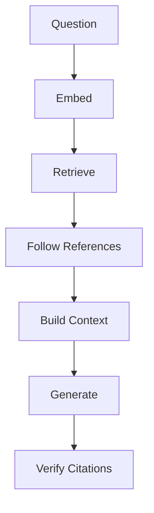

Every job listing I saw this year mentioned RAG, and many of them specifically mentioned graph RAG. I work with FHIR R4 and clinical data daily, and one question kept coming back: FHIR already gives you structured, coded, individually-addressable resources for every clinical fact in a patient record, and those resources link to each other through explicit references (an Observation points to its Encounter, a MedicationRequest points to its Medication and Patient). The data is already a graph. If any data was a good fit for retrieval-augmented generation, this should be it.

I decided to build it and find out. The system answers clinical questions over FHIR R4 records, with one hard constraint: every claim in the answer has to point at the resource it came from. When the record cannot support an answer, the system has to say so instead of producing something plausible.

A question like "What is this patient's most recent HbA1c, and how has it trended?" touches a dozen `Observation` resources, at least one `Condition`, and the `Encounter` each result was drawn at. "What insulin is she on?" needs `MedicationRequest` resources plus enough context to know which ones are still active. Retrieving the right resources was the easier part. Getting the system to refuse when the data is not there was harder.

## Why grounding, not just answering

The system could answer questions after the first week. The problem was that wrong answers looked exactly like right ones. A fabricated HbA1c value of 7.2% reads the same as a real one. There is nothing in the sentence that marks it as invented, and the reader has no way to check it without going back to the source record, which is the work the system was supposed to save.

In most RAG demos, a confidently wrong answer is embarrassing. In a clinical context it is the failure mode that matters. The design target became **grounding**: a machine-checkable link from every claim back to a specific FHIR resource, and an explicit refusal when that link cannot be made.

That constraint shaped every layer below it. The chunk boundary is one resource, one chunk, because a citation needs a stable id. The prompt enforces citation format. The API returns a grounding verdict alongside every answer.

## The pipeline

The request path has seven stages:



The code reads the same way:

```python
# src/api/routes.py
query_embedding = embedder.embed_query(query.question)
primary = await hybrid_search(
    pool,
    query_embedding,
    query_text=query.question,
    patient_ref=query.patient_ref,
    resource_types=query.resource_types,
    top_k=settings.top_k,
)
supplementary = await resolve_references(
    pool, primary, max_hops=settings.max_reference_hops
)
context = build_context(primary, supplementary)
system_prompt = _prompt_environment.get_template("clinical_qa.jinja2").render(
    context=context, question=query.question,
)
llm_response = await llm_client.generate(system_prompt, query.question)
grounded = map_citations(llm_response.content, query.question, primary + supplementary)
```

Embed the question. Retrieve candidate resources with hybrid search. Follow FHIR references to pull in supporting context. Assemble a citation-ready context block. Render the prompt. Generate. Then verify what came back.

Ingestion is the mirror image. Parse Synthea bundles into individual resources, render each one to human-readable text, embed that text, and store it with its metadata in Postgres.

## One resource, one chunk

The common RAG approach is to split documents into overlapping token windows, but a FHIR resource is already a clinically meaningful unit with a stable identifier. Splitting one destroys the citation target. Merging several puts unrelated clinical facts in the same retrievable blob. The right chunk boundary is the one FHIR already defines.

The chunker does almost nothing, and that is intentional:

```python
# src/ingestion/chunker.py
def chunk_resource(parsed: ParsedResource) -> FHIRChunk:
    """Convert a ParsedResource into a FHIRChunk with structured metadata."""
    return FHIRChunk(
        resource_id=parsed.resource_id,
        resource_type=parsed.resource_type,
        patient_ref=parsed.patient_ref or "",
        resource_date=extract_date(parsed.resource_json, parsed.resource_type),
        codes=extract_codes(parsed.resource_json),
        references=list(parsed.references),
        text_content=render_resource_text(parsed.resource_json, parsed.resource_type),
    )
```

The metadata carried alongside the text is what makes the rest of the system work. `patient_ref` scopes retrieval to one record. `resource_date` supports temporal filters. `codes` holds every SNOMED, LOINC, and RxNorm coding found in the resource. `references` holds outbound links, which is how the reference resolver walks the graph later.

## Postgres does all four jobs

The system needs a vector index, a full-text index, relational filters, and joins. pgvector inside PostgreSQL gives me all four against the same rows. There is no second datastore to keep in sync and no network hop between "find similar" and "filter to this patient".

```sql
-- db/init.sql
CREATE TABLE IF NOT EXISTS fhir_chunks (
    id UUID PRIMARY KEY DEFAULT gen_random_uuid(),
    resource_id TEXT NOT NULL UNIQUE,
    resource_type TEXT NOT NULL,
    patient_ref TEXT NOT NULL,
    resource_date TIMESTAMPTZ,
    codes JSONB DEFAULT '[]',
    "references" TEXT[] DEFAULT '{}',
    text_content TEXT NOT NULL,
    embedding vector(384) NOT NULL,
    text_search TSVECTOR GENERATED ALWAYS AS (to_tsvector('english', text_content)) STORED,
    created_at TIMESTAMPTZ DEFAULT now()
);
```

`text_search` is a generated column so the lexical index can never drift from the text it indexes, and re-ingestion needs no extra write path. Embeddings are 384-dimensional, from `all-MiniLM-L6-v2` running on CPU.

Retrieval runs two arms over that table, a vector arm and a full-text arm, and fuses them with weighted Reciprocal Rank Fusion. That query went through the most debugging iterations of any part of the system, and it gets its own article later in this series.

## Verification, not trust

The prompt asks for citations in a fixed format:

```
Rules:
1. Base your answer exclusively on the provided FHIR context.
2. Cite specific resource IDs using [ResourceType/id] format.
3. If the provided context does not contain enough information to answer, say:
   "Insufficient data in the available FHIR resources to answer this question."
4. Never fabricate clinical information, medications, diagnoses, or dates.
```

The model does not always follow those rules. Every citation the model emits is parsed back out and checked against the set of resources that were actually retrieved:

```python
# src/generation/citation_mapper.py
matches = CITATION_PATTERN.findall(llm_response)
resources = {
    (r.resource_type.lower(), r.resource_id.split("/", 1)[-1].lower()): r
    for r in available_resources
}
...
if not matches or valid_count == 0:
    confidence = "ungrounded"
elif valid_count == len(matches):
    confidence = "grounded"
else:
    confidence = "partially_grounded"
```

A cited id that was never retrieved does not become a citation. It becomes evidence that the answer is not fully grounded, and the API says so. The UI shows that verdict next to the answer rather than hiding it.

## Running it

Postgres with pgvector and the app both come up from one Compose file. Data comes from [Synthea](https://github.com/synthetichealth/synthea), which generates synthetic patient records that are realistic enough to be useful and carry no privacy risk at all.

```bash
java -jar synthea-with-dependencies.jar -p 70 --exporter.fhir.export=true
cp output/fhir/*.json data/synthea/
docker compose up -d
docker compose exec app python -m src.ingestion.ingest --data-dir data/synthea/
```

Then open `http://localhost:8000`, pick a patient, and ask. One thing from the README worth repeating: do not use Synthea's `-m diabetes` flag to build a diabetes cohort. `-m` filters loaded modules, not patients, and it will produce a corpus with no `Observation` or `MedicationRequest` resources at all. This cost me an afternoon of debugging before I checked the generated bundles.

## What it scores

Against a 78-patient corpus, 52 evaluation questions across two cohorts (adults with type 2 diabetes, and a pediatric patient with the atopic march and no glucose data at all):

| Metric | Score |
| --- | --- |
| Retrieval recall | 0.971 |
| Citation accuracy | 0.957 |
| Answer-keyword coverage | 0.952 |
| Grounded / partial / ungrounded | 45 / 0 / 7 |
| Latency (mean / max) | 14.7 s / 27.3 s |

Five of the seven ungrounded results are the negative-control questions, where refusing is the correct behaviour. Latency is entirely generation-bound; patient-scoped retrieval itself runs in 5 to 24 ms.

## What it still gets wrong

Two known problems.

Near-duplicate resources compete for retrieval slots. Synthea emits one `Medication review due` Condition per visit, they embed to nearly identical vectors, and at one point twelve of them occupied every Condition slot in the top 25 for a generic "what are the active problems?" question. That is fixed in practice but not fixed properly. Diversity-aware retrieval is still unimplemented.

There is no authentication. Every endpoint trusts the caller-supplied `patient_ref`. That is fine for a local demo over synthetic data and disqualifying for anything else.

## Next

This is the first in a series. The next article covers what actually lives in a FHIR record, written for people who know embeddings but have never opened a patient chart. After that the series gets into the parts that broke: a hybrid search arm that silently matched nothing for weeks, a CTE that hid two indexes, and a re-embed that computed 77,466 vectors and saved none of them.

The full source is on GitHub. If you want to see the design decisions with their evidence attached, `docs/notes/fhir-rag-debugging.md` is the honest version of this article.

---

*I work on clinical data systems at a research unit, mostly FHIR R4, HL7 v2, and HAPI FHIR. This series documents an open-source grounded RAG system over FHIR records: [github.com/budityw23/fhir-rag](https://github.com/budityw23/fhir-rag).*
