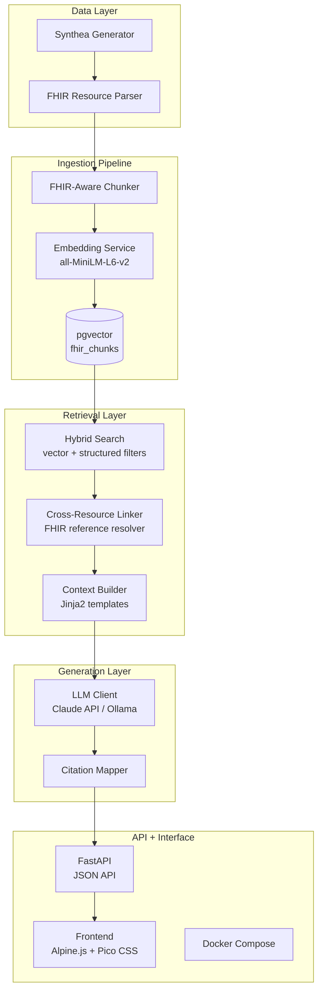

# fhir-rag — Project Plan (v2) — Diabetics Use Case

Clinical Q&A over FHIR R4 patient data using retrieval-augmented generation.
FHIR-aware chunking, hybrid retrieval, grounded citations.
**Domain focus: Type 1 and Type 2 Diabetes management.**

> Updated 2026-08-25. Previous version replaced the architecture JSX with Mermaid,
> restructured milestones for Codex-driven implementation, and tightened dependency versions.
> v2 narrows the clinical domain to diabetes for deeper, more meaningful demonstrations.

---

## Architecture Overview



---

## V1 — MVP

### Goal

A working demo: ask natural language questions about **diabetic patients** (Type 1 & Type 2), get grounded answers citing specific FHIR resources. Runs with one `docker compose up`.

### Stack (pinned versions)

| Component | Version / Notes |
|---|---|
| Python | 3.11+ |
| FastAPI | 0.115+ (JSON API, mounts static frontend) |
| Alpine.js | 3.x (vendored in `src/frontend/vendor/`, not CDN) |
| Pico CSS | 2.x (vendored in `src/frontend/vendor/`, not CDN) |
| PostgreSQL | 16 + pgvector 0.7+ |
| fhir.resources | 7.1+ (pydantic v2 FHIR R4 models) |
| sentence-transformers | 3.0+ (`all-MiniLM-L6-v2`, 384-dim) |
| Claude API | claude-sonnet-4-6 (primary) |
| Ollama | local fallback for reviewers without API keys |
| Docker Compose | v2 syntax |

**No node_modules. No build step. Frontend is static HTML served by FastAPI.**

Frontend assets (Alpine.js, Pico CSS) are vendored into `src/frontend/vendor/` so the app works fully offline inside Docker without CDN dependencies.

### Milestone 1 — Data & Ingestion

**Generate diabetic patient data**
- Install Synthea, generate patients using diabetes modules:
  - Type 2: `java -jar synthea.jar -m diabetes -p 50`
  - Type 1: `java -jar synthea.jar -m type1_diabetes -p 20`
- Output as FHIR R4 JSON Bundles (~70 diabetic patients total)
- Store in `data/synthea/`
- Expected resources per patient: Condition (diabetes, complications), Observation (HbA1c, glucose, BMI, lipids), MedicationRequest (Metformin, insulin), CarePlan (diabetes self-management), Procedure (eye/foot exams), Encounter

**Build FHIR parser**
- Load each Bundle JSON
- Validate with `fhir.resources` pydantic models
- Extract individual resources: Patient, Condition, Observation, MedicationRequest, Encounter, AllergyIntolerance, Procedure, DiagnosticReport, Immunization, CarePlan
- Resolve internal references (record who references whom)

**Build FHIR-aware chunker**
- One resource = one chunk (never split a resource, never merge resources)
- Each chunk gets structured metadata:
  - `resource_type` (e.g., "Condition", "Observation")
  - `patient_ref` (e.g., "Patient/abc-123")
  - `date` (resource-specific: effectiveDateTime, onsetDateTime, authoredOn, etc.)
  - `codes` (SNOMED, LOINC, RxNorm codes from the resource)
  - `references` (list of other resource IDs this resource points to)
- Text representation: human-readable flattening of the resource (not raw JSON)

**Embed and store**
- Embed the text representation using `all-MiniLM-L6-v2` (384-dim, fast, good enough for v1)
- Store in pgvector table:

```sql
CREATE TABLE fhir_chunks (
    id UUID PRIMARY KEY DEFAULT gen_random_uuid(),
    resource_id TEXT NOT NULL UNIQUE,
    resource_type TEXT NOT NULL,
    patient_ref TEXT NOT NULL,
    resource_date TIMESTAMPTZ,
    codes JSONB DEFAULT '[]',
    references TEXT[] DEFAULT '{}',
    text_content TEXT NOT NULL,
    embedding vector(384) NOT NULL,
    created_at TIMESTAMPTZ DEFAULT now()
);

CREATE INDEX idx_fhir_chunks_embedding ON fhir_chunks
    USING hnsw (embedding vector_cosine_ops) WITH (m = 16, ef_construction = 64);
CREATE INDEX idx_fhir_chunks_resource_type ON fhir_chunks (resource_type);
CREATE INDEX idx_fhir_chunks_patient_ref ON fhir_chunks (patient_ref);
CREATE INDEX idx_fhir_chunks_resource_date ON fhir_chunks (resource_date);
CREATE INDEX idx_fhir_chunks_resource_id ON fhir_chunks (resource_id);
```

> Changed from IVFFlat to HNSW: IVFFlat requires manual `lists` tuning based on row count and needs retraining after bulk inserts. HNSW is insert-friendly and works well at any scale without tuning.

**Deliverable:** `python -m src.ingestion.ingest` loads all Synthea bundles into pgvector.

### Milestone 2 — Retrieval

**Hybrid search**
- Accept: natural language query + optional filters (patient_ref, resource_type, date_range)
- Step 1: Embed the query
- Step 2: SQL query combining vector similarity with structured filters:

```sql
SELECT *, 1 - (embedding <=> $query_vector) AS similarity
FROM fhir_chunks
WHERE ($patient IS NULL OR patient_ref = $patient)
  AND ($types IS NULL OR resource_type = ANY($types))
  AND ($start IS NULL OR resource_date >= $start)
  AND ($end IS NULL OR resource_date <= $end)
ORDER BY embedding <=> $query_vector
LIMIT $top_k;
```

- Step 3: Return top-k chunks with metadata

**Cross-resource resolution**
- For each retrieved chunk, check its `references` field
- Pull referenced resources from the DB (direct lookup by resource_id, no vector search)
- Attach as supplementary context (not scored by similarity, but included for completeness)
- Cap at 2 hops to prevent context explosion

**Context builder**
- Assemble retrieved + resolved resources into a structured prompt block
- Group by resource type, include resource IDs for citation
- Jinja2 template for consistency

**Deliverable:** `python -m src.retrieval.hybrid_search "What diabetes medications is patient X on?"` returns ranked FHIR resources.

### Milestone 3 — Generation & API

**Prompt engineering**
- System prompt (`clinical_qa.jinja2`):
  - Role: clinical data assistant
  - Instruction: answer ONLY from provided FHIR context
  - Cite specific resource IDs (e.g., [MedicationRequest/abc])
  - Say "insufficient data" when context doesn't support an answer
  - Never fabricate clinical information

**LLM client**
- Primary: Claude API (claude-sonnet-4-6)
- Fallback: Ollama with a local model (for reviewers without API keys)
- Config via environment variable: `LLM_PROVIDER=claude|ollama`

**Citation mapper**
- Parse LLM response for resource ID references
- Match back to actual retrieved resources
- Return structured response:

```json
{
  "answer": "Patient is currently taking Metformin 500mg...",
  "citations": [
    {
      "resource_id": "MedicationRequest/abc-456",
      "resource_type": "MedicationRequest",
      "text_snippet": "Metformin 500mg oral tablet, active",
      "date": "2024-03-15"
    }
  ],
  "confidence": "grounded",
  "query": "What medications is this patient taking?"
}
```

**FastAPI endpoints (JSON API)**

```
POST /api/query
  body: { question: str, patient_ref: str?, resource_types: list[str]? }
  returns: { answer, citations, confidence }

GET  /api/patients
  returns: list of available patients with id and display name

GET  /api/patients/{patient_ref}/resources
  query: resource_type?, limit?
  returns: list of FHIR resources for a patient

GET  /api/resources/{resource_id}
  returns: full FHIR resource JSON for drill-down

GET  /health
  returns: { status, db_connected, chunks_count }
```

- All endpoints return JSON, testable via Swagger at `/docs`
- FastAPI mounts `src/frontend/` as static files at `/`

**Frontend (Alpine.js + Pico CSS)**

```
src/frontend/
├── index.html        <- single page: search, results, citations
├── app.js            <- Alpine.js app logic
├── style.css         <- minimal overrides
└── vendor/           <- vendored Alpine.js + Pico CSS (no CDN)
```

**Deliverable:** working UI at localhost:8000, JSON API at localhost:8000/docs.

### Milestone 4 — Eval, Docker & Polish

**Evaluation harness**
- Create `eval/questions.json`: 50 diabetes-focused question/answer pairs with expected resource IDs
  (sourced from `docs/diabetics-validation-questions.md`)
- Covers 10 categories: diagnosis, HbA1c monitoring, medications, complications, vitals/labs,
  care plans, cross-resource reasoning, temporal trends, preventive screenings, negative/boundary
- Metrics:
  - Retrieval recall: did the correct FHIR resources appear in top-k?
  - Answer faithfulness: does the answer only reference retrieved context?
  - Citation accuracy: do cited resource IDs match real resources?
- Run: `python -m eval.evaluate` prints metrics table

**Docker Compose**
- Services: `app` (FastAPI), `db` (postgres+pgvector), `ollama` (optional)
- Single `.env.example` for API keys
- Health checks on all services
- `db/init.sql` for schema creation on first boot

**README**
- Mermaid architecture diagram
- One-command setup: `docker compose up`
- Example queries with screenshots
- Design decisions (why HNSW over IVFFlat, why FHIR-aware chunking, why hybrid search)
- Evaluation results
- Limitations and v2 roadmap

**Deliverable:** portfolio-ready repo.

---

## Project Structure

```
fhir-rag/
├── docker-compose.yml
├── Dockerfile
├── .env.example
├── pyproject.toml
├── README.md
├── data/
│   └── synthea/                    # generated FHIR bundles (gitignored)
├── db/
│   └── init.sql                    # pgvector schema + indexes
├── src/
│   ├── __init__.py
│   ├── config.py                   # pydantic Settings, env loading
│   ├── database.py                 # async pg connection pool
│   ├── ingestion/
│   │   ├── __init__.py
│   │   ├── ingest.py               # CLI entrypoint
│   │   ├── fhir_parser.py          # Bundle → individual resources
│   │   ├── chunker.py              # FHIR-aware chunking
│   │   ├── text_renderer.py        # resource → human-readable text
│   │   └── embedder.py             # sentence-transformers wrapper
│   ├── retrieval/
│   │   ├── __init__.py
│   │   ├── hybrid_search.py        # vector + structured SQL
│   │   ├── reference_resolver.py   # follow FHIR references (2-hop max)
│   │   └── context_builder.py      # assemble prompt context
│   ├── generation/
│   │   ├── __init__.py
│   │   ├── prompts/
│   │   │   └── clinical_qa.jinja2  # system prompt template
│   │   ├── llm_client.py           # Claude / Ollama abstraction
│   │   └── citation_mapper.py      # parse + validate citations
│   ├── api/
│   │   ├── __init__.py
│   │   ├── main.py                 # FastAPI app factory + lifespan
│   │   ├── routes.py               # API endpoints
│   │   └── schemas.py              # request/response pydantic models
│   └── frontend/
│       ├── index.html
│       ├── app.js
│       ├── style.css
│       └── vendor/                 # Alpine.js + Pico CSS (vendored)
├── tests/
│   ├── conftest.py                 # fixtures: test DB, sample bundles
│   ├── test_fhir_parser.py
│   ├── test_chunker.py
│   ├── test_text_renderer.py
│   ├── test_hybrid_search.py
│   ├── test_citation_mapper.py
│   └── test_api.py                 # FastAPI TestClient
├── eval/
│   ├── questions.json              # evaluation dataset
│   └── evaluate.py                 # retrieval quality metrics
└── docs/
    ├── fhir-rag-project-plan.md            # this file
    ├── codex-implementation-plan.md
    └── diabetics-validation-questions.md   # 50 diabetes Q&A for eval
```

---

## V2 — Production Features (Future)

### HAPI FHIR Integration
- Add HAPI FHIR server to docker-compose as a data source
- New ingestion mode: pull resources via FHIR REST API instead of reading local JSON
- Supports SMART on FHIR auth flow
- Framing: "plug this RAG layer into any existing FHIR server"

### Graph RAG (Neo4j)
- Materialize FHIR references as a knowledge graph in Neo4j
- Enable multi-hop reasoning queries (4+ hops across resource types)
- Compare retrieval quality: pgvector-only vs graph-augmented

### Advanced Retrieval
- Reranking with a cross-encoder (after initial vector retrieval)
- Query decomposition: break complex clinical questions into sub-queries
- Temporal reasoning: time-series awareness for trend questions

### Multi-Patient Analytics
- Cohort queries: "how many patients have uncontrolled diabetes?"
- Aggregate statistics with RAG-generated natural language summaries

### Production Hardening
- Caching layer for frequent queries
- Audit logging (who queried what)
- Role-based access control
- Observability: LLM latency, retrieval quality metrics, token usage

---

## What This Demonstrates to Employers

| Skill | Evidence |
|---|---|
| FHIR R4 depth | Custom chunker that understands resource boundaries, references, code systems |
| RAG engineering | Hybrid retrieval, prompt grounding, citation mapping, eval harness |
| Python / FastAPI | Clean API design, pydantic schemas, async endpoints |
| Data engineering | Ingestion pipeline, pgvector, structured + unstructured search |
| DevOps | Docker Compose, one-command setup, env config |
| System design | Documented decisions, clear v1/v2 boundary, tradeoff reasoning |
| Healthcare domain | Clinically meaningful queries, appropriate safety guardrails |
| Domain specialization | Diabetes-focused use case shows depth over breadth — understanding of HbA1c monitoring, medication progression, complication screening workflows |
